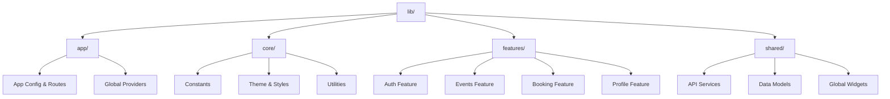

# 🏗️ SPOTA Architecture & Engineering Guide

This document provides a technical deep-dive into the architecture, design patterns, and engineering practices used in the **SPOTA** project.

---

## 📐 Architectural Pattern

SPOTA follows a **Feature-Based Clean Architecture**. This approach organizes code primarily by *what it does* (features) rather than *what it is* (layers). This ensures:
- **Scalability:** New features can be added without modifying unrelated code.
- **Maintainability:** Code related to a specific feature is kept together.
- **Testability:** Business logic is separated from UI.

### Design Principles
- **Separation of Concerns:** UI, Business Logic, and Data layers are distinct.
- **Dependency Injection:** Services and Repositories are provided via `Provider`.
- **Single Responsibility:** Each class has one clear purpose.

---

## 📂 Directory Structure

Here is the high-level organization of the `lib/` directory:

### Detailed Breakdown

#### 1. `features/*`
Each folder here represents a domain capability.
- **auth/**: Login, Registration, Password Reset.
- **events/**: Listing, Searching, and Filtering events.
- **booking/**: Ticket selection, Payment (Chapa), and Confirmation.
- **organizer/**: Organizer dashboard, Event creation, Analytics.
- **profile/**: User profile, Ticket history, Settings.
- **admin/**: User oversight and platform metrics.

Inside each feature:
- `screens/`: Full-page widgets (Scaffolds).
- `widgets/`: Smaller, reusable components specific to that feature.

#### 2. `shared/*`
Code used by multiple features.
- **services/**:
  - `AuthService`: Firebase Authentication wrapper.
  - `EventService`: Firestore CRUD operations for events.
  - `ChapaService`: HTTP client for Chapa payment gateway.
  - `CloudinaryService`: Image upload handling.
  - `AfroMessageService`: SMS notification logic.
- **models/**: Dart data classes (`Event`, `User`, `Booking`) with `fromJson`/`toJson`.

#### 3. `core/*`
Application foundation.
- `theme/`: Colors, Typography, and AppTheme definitions.
- `utils/`: Validators, DateFormatters, Helper functions.

---

## 🔄 Data Flow Strategy

We use a **Unidirectional Data Flow** powered by `Provider`.

### 1. The READ Flow (Fetching Data)
1. **Ui Widget** (e.g., `HomeScreen`) requests data.
2. **Provider** exposes a `Stream` or `Future` from the **Service**.
3. **Service** (`EventService`) queries **Firestore**.
4. **Firestore** returns a snapshot.
5. **Model** parses the snapshot into Dart objects (`List<Event>`).
6. **UI** rebuilds automatically via `StreamBuilder` or `Consumer`.

### 2. The WRITE Flow (User Action)
1. **User** interacts (e.g., "Book Ticket").
2. **UI** calls a method on the **Service** (e.g., `eventService.bookTickets()`).
3. **Service** performs business logic:
    - Calls **Chapa API** for payment.
    - Updates **Firestore** (decrements tickets).
    - Triggers **SMS** via `AfroMessageService`.
4. **Service** returns success/failure.
5. **UI** shows feedback (SnackBar/Dialog) and effectively updates via the stream.

---

## 🛠️ State Management

**Provider** is the primary state management solution.

- `AuthProvider`: Manages user session state (`currentUser`, `isLoading`).
- `StreamProvider` (or direct streams): Used for real-time data like Event Lists.
- `StatefulWidget`: Used for ephemeral UI state (e.g., current tab, text input) where global state is overkill.

---

## 🔒 Security & Data Integrity

- **Role-Based Access Control (RBAC):** 
    - Determining user role (`attendee`, `organizer`, `admin`) at login.
    - UI guards (conditional rendering) to hide unauthorized screens.
- **Firestore Rules:** Backend enforcement to prevent unauthorized writes.
- **Payment Verification:** Chapa transactions are verified server-side (or via secure API calls) before confirming bookings.

---
